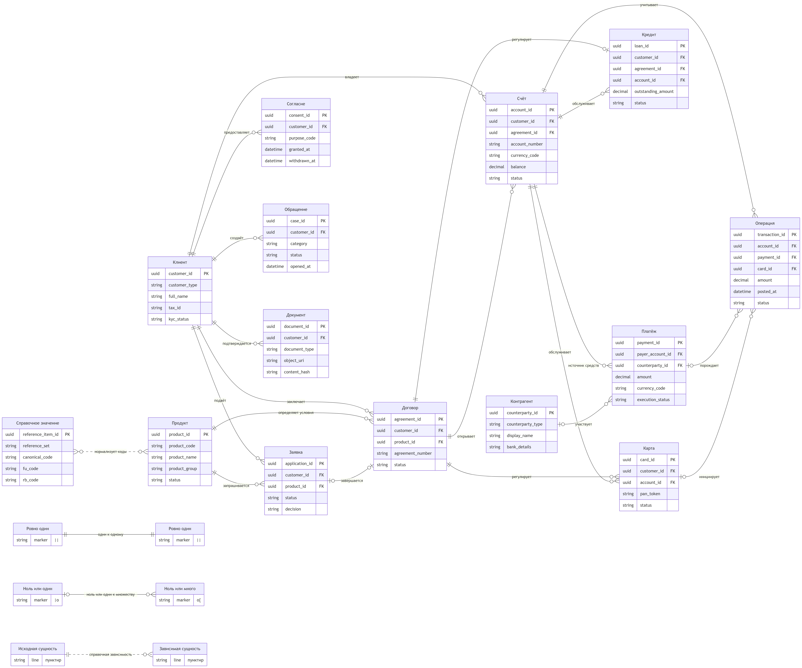

# Логическая модель данных

Исходник ER-диаграммы: [`diagrams/logical-data-model.mmd`](diagrams/logical-data-model.mmd).

Модель описывает единый бизнес-язык объединённого банка. Это не физическая схема конкретной БД: типы данных и ключи показывают требуемую семантику, но не назначают конкретные мастер-системы.

## Основные агрегаты

### Клиент и обслуживание

`Клиент` является корнем клиентского профиля. С ним связаны заявки, согласия, документы и обращения. Глобальный `customer_id` обеспечивает единую ссылку, а `source_ids` сохраняет идентификаторы FU и RB, чтобы любое объединённое значение можно было проследить до источника.

Обращение использует полиморфную ссылку `related_object_type + related_object_id`: оно может относиться к счёту, договору, карте, кредиту или платежу. При физической реализации такую ссылку следует заменить проверяемой моделью связей, например отдельными таблицами `case_subject`, чтобы не потерять ссылочную целостность.

### Продукт и договорные отношения

`Продукт` — шаблон предложения и условий, `Заявка` — намерение клиента получить продукт, `Договор` — юридически значимый результат, а счёт, карта или кредит — обслуживаемый экземпляр продукта.

Кардинальности отражают типичный сценарий:

- один продукт используется во многих заявках и договорах.
- заявка может завершиться одним договором либо отказом без договора.
- договор может открыть несколько счетов или регулировать выпуск нескольких карт.
- кредит связан ровно с одним профильным договором, однако договор не обязательно является кредитным.

### Финансовый учёт

`Счёт` — центр денежного учёта.  
`Платёж` отражает распоряжение и состояние его исполнения.  
`Операция` — отдельный финансовый факт.   
Поэтому один платёж может породить несколько операций: списание, зачисление, комиссию и корректировку. Операции без платежа допустимы для начисления процентов, комиссий или служебных проводок.

Текущий баланс хранится в авторитетной OLTP-системе счёта. Исторический баланс для аналитики должен вычисляться из операций или храниться как датированные снимки. Он не моделируется отдельной мастер-сущностью.

## Правила идентификации

1. Целевые идентификаторы — технические UUID, не содержащие бизнес-смысла.
2. Локальные ключи FU/RB не перезаписываются и входят в таблицы соответствий с указанием системы, типа объекта и периода действия.
3. Номер счёта, PAN, номер договора, ИНН и реквизиты документа не используются как единственный технический ключ: они могут изменяться, перевыпускаться либо быть ошибочно продублированы.
4. Для платежей и операций необходимы идемпотентные ключи загрузки: `source_system + source_id + source_event_version`.
5. Объединение клиентов выполняется по набору нормализованных атрибутов с уровнем уверенности и признаком ручного подтверждения. Детальные правила матчинга находятся за границами этой логической модели.

## Временная и финансовая семантика

- Для договора, продукта, согласия и справочного значения сохраняются период действия и версия.
- У операции различаются время бизнес-события и время бухгалтерской проводки.
- Сторно не удаляет исходную операцию, а создаёт связанную компенсирующую запись.
- Денежные значения всегда хранятся вместе с валютой и фиксированной точностью.
- Все временные метки интеграционного слоя нормализуются в UTC, при необходимости сохраняется исходный часовой пояс.

## Ссылочная целостность и жизненный цикл

- Финансовые факты и юридически значимые версии не удаляются физически. Вместо удаления используются статус, дата окончания действия и журнал аудита.
- Закрытие клиента не должно каскадно удалять договоры, счета, платежи или операции.
- Отзыв согласия распространяется по потребителям, но доказательство ранее действовавшего согласия сохраняется согласно срокам хранения.
- Документ хранится как объект, а в логической модели находятся метаданные, хеш целостности и URI.
- Коды статусов, типов и каналов сопоставляются с каноническими справочными значениями, при этом исходный код сохраняется для lineage.

## Допущения для уточнения

- AS-IS не показывает отдельные системы документооборота, KYC/AML, каталога продуктов и управления согласиями. До инвентаризации их данные считаются частью CRM или профильных систем.
- На диаграмме один основной владелец счёта. Совместные счета и доверенные лица потребуют ассоциативную сущность `PartyAccountRole`.
- Контрагент отделён от клиента. Если контрагент также клиент банка, связь должна указывать на `customer_id`, не смешивая две роли.
- График кредита показан атрибутом агрегата. В физической модели он станет набором версионируемых строк графика.
