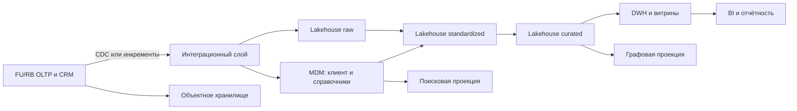

# Стратегия хранения данных

## Принцип распределённого владения

Единого универсального хранилища для всех данных не вводится. Тип хранилища выбирается по рабочей нагрузке, требованиям целостности и жизненному циклу:

- профильные OLTP-системы сохраняют авторитетное операционное состояние.
- MDM управляет золотыми записями клиентов и общими справочниками.
- DWH обслуживает согласованную регламентированную отчётность.
- Data Lakehouse хранит детальную историю и события для аналитики.
- объектное хранилище содержит файлы и неизменяемые архивы.
- графовая БД и поисковый движок являются перестраиваемыми проекциями, а не системами записи.

Такое разделение не создаёт аналитическую нагрузку на Core Banking, Cards и Loans и не требует одномоментной замены систем RetailBank.

## Матрица размещения

| Группа данных | Основные сущности | Система записи / тип | Аналитическое или специализированное хранение | Обоснование |
|---|---|---|---|---|
| Клиентский профиль | • Клиент  • Согласие | • Переходный период: CRM  • Целевое хранение: MDM/Customer Hub для золотой записи и таблиц соответствий | • DWH для Customer 360  • Защищённая историзация в Lakehouse | • Нужны дедупликация, единый ID, survivorship и распространение согласованных атрибутов  • Согласия требуют неизменяемой истории |
| Общие классификаторы | • Справочное значение  • Канонические коды продукта | MDM / Reference Data Management | Версионированные копии в DWH и Lakehouse | Централизованный кросс-маппинг FU/RB устраняет семантические расхождения |
| Счета и договоры | • Счёт  • Договор | Профильные Core Banking OLTP | • Снимки и факты в DWH  • Полная история изменений в Lakehouse | • Требуются ACID, строгая целостность и низкая задержка  • MDM не должен проводить финансовые операции |
| Карточный контур | • Карта  • Карточная операция | FU/RB Cards OLTP в PCI-сегменте | Токенизированные факты в DWH/Lakehouse | • Нужна высокая доступность и специализированный жизненный цикл  • Аналитические копии отделены от PAN |
| Кредитный контур | • Кредит  • График  • Кредитная заявка | FU/RB Loans OLTP | • Портфель и снимки в DWH  • История решений и события в Lakehouse | • Профильная система рассчитывает долг и график  • DWH обеспечивает согласованный срез отчётности |
| Платежи и учёт | • Платёж  • Операция | • Core Banking OLTP  • Неизменяемый журнал проводок | • Факты операций в DWH  • Детальные события в Lakehouse | • ACID и идемпотентность защищают движение денег  • Длинная история не замедляет OLTP |
| Продажи и сервис | • Продукт  • Заявка  • Обращение | • CRM и профильные OLTP  • Целевой каталог продуктов для версий предложения | • DWH для воронок и SLA  • Поисковый индекс обращений  • Lakehouse для событий | Нужны оперативная работа, аналитика и полнотекстовый поиск с независимым масштабированием |
| Документы | • Документ  • Доказательства согласия и договора | • Метаданные в CRM/MDM  • Содержимое в объектном хранилище | • Архивные классы object storage  • Извлечённый текст в поисковом индексе при необходимости | Объекты дешевле масштабируются, поддерживают versioning, retention lock и контроль хеша |
| Связи сторон | • Клиент  • Контрагент  • Счета  • Переводы | Авторитетные атрибуты остаются в CRM/Core/MDM | Опциональная графовая проекция | Граф ускоряет AML и поиск связанных лиц, но строится из трассируемых источников и может быть пересоздан |

## Роли типов хранилищ

### OLTP БД

Используются для счетов, договоров, карт, кредитов, платежей и операций. Обязательны ACID-транзакции, ограничения ссылочной целостности, журналирование и отказоустойчивость. История выводится через CDC или контролируемые инкрементальные выгрузки, а не тяжёлые аналитические запросы к рабочим таблицам.

На переходном этапе FU и RB сохраняют собственные OLTP. Глобальный идентификатор и таблицы соответствий позволяют объединять данные без немедленной физической миграции.

### MDM / Customer Hub

Подходит для клиента, общих справочников и при необходимости канонических идентификаторов продукта. Функции:

- хранение локальных ключей FU/RB и глобального ключа.
- match/merge с оценкой уверенности.
- survivorship по атрибутам и ручное разрешение конфликтов.
- версионирование и публикация изменений потребителям.
- контроль владельца, качества и происхождения.

MDM не становится системой записи счетов, балансов, кредитной задолженности, платежей и операций: эти данные остаются в профильных банковских системах.

### DWH

DWH хранит очищенные, согласованные и датированные данные для регуляторной и управленческой отчётности и BI. Загрузка выполняется из интеграционного слоя, CDC или Lakehouse, чтобы отчёты не обращались напрямую к OLTP.

Для финансовых фактов сохраняются дата среза, бизнес-дата, система происхождения, исходный ключ, версия правила преобразования и результаты сверки. Публикация отчёта разрешается только после контроля полноты и денежных итогов.

### Data Lakehouse

Lakehouse объединяет недорогую детальную историю с управляемыми таблицами, схемой, ACID-операциями и каталогом. В него поступают:

- CDC-события Core, Cards и Loans.
- карточные и платёжные события.
- исторические выгрузки RB DWH.
- версии заявок, обращений и кредитных решений.
- сырые, очищенные и курированные наборы с lineage.

Рекомендуемые логические зоны: `raw` (неизменяемая копия источника), `standardized` (канонические типы и коды), `curated` (проверенные доменные наборы). Доступ к каждой зоне регулируется отдельно.

### Объектное хранилище

Хранит сканы, договорные файлы, доказательства согласий, архивные выгрузки и резервные наборы. Метаданные и ссылки остаются в транзакционной модели. Требуются:

- запрет публичного доступа и шифрование.
- versioning, lifecycle policy и retention lock.
- хеш содержимого и антивирусная проверка при загрузке.
- раздельные контейнеры и ключи для классов данных.
- signed URL с коротким сроком вместо передачи постоянной ссылки.

### Графовая БД

Обоснована как опциональная read-модель для связей «клиент — контрагент — счёт — платёж» в AML, fraud и анализе связанных лиц. Не рекомендуется в качестве первичного хранилища: денежные факты и идентичность остаются в Core/MDM. Каждое ребро содержит ссылку на источник, время действия и правило построения.

### Поисковый движок

Обоснован для обращений, метаданных документов и оперативного поиска клиентского сервиса. Индекс:

- строится асинхронно из CRM/объектного хранилища.
- фильтрует результаты теми же правами доступа, что и источник.
- хранит минимальный набор ПДн, шифруется и аудитируется.
- полностью перестраивается из авторитетных данных.
- не используется для расчёта балансов и регуляторной отчётности.

## Поток данных и защита от расхождений

Для каждого потока задаются контракт схемы, владелец, SLA, идемпотентный ключ, контроль количества записей и финансовых сумм, карантин ошибок и lineage. Изменение канонической схемы версионируется. Несовместимое изменение не публикуется без миграции потребителей.

## Этапность

### Промежуточное состояние — 3 месяца

1. Не переносить транзакционную ответственность: FU/RB OLTP продолжают обслуживать свои портфели.
2. Создать Customer Hub или минимальный MDM-контур с глобальным ID, таблицей соответствий и правилами матчинга.
3. Ввести канонические кросс-справочники для критичных статусов и кодов.
4. Организовать контролируемые инкрементальные поставки в общий аналитический контур.
5. Построить минимальные DWH-витрины клиентов, счетов, продуктов и операций со сверкой с обоими DWH.
6. Зарегистрировать наборы, владельцев, качество и lineage. Архивные выгрузки RB складывать в защищённое объектное хранилище.

### Целевое состояние — 12 месяцев

1. Развернуть полноценные MDM и Reference Data Management с governance-процессами.
2. Перевести детальную историю и события в управляемый Lakehouse, сохранив DWH как слой регламентированной модели и BI.
3. Подключить CDC и событийную доставку к приоритетным источникам, исключив тяжёлые batch-запросы к OLTP.
4. Мигрировать домены поэтапно после сверки, параллельного прогона и подтверждения владельцев. Только затем выводить дублирующие RB-компоненты.
5. Добавить поисковую и графовую проекции только после стабилизации качества и правил доступа.

## Отклонённые варианты

- **Один общий DWH как мастер всех данных:** не обеспечивает операционную целостность и создаёт задержку для обслуживания.
- **MDM для счетов и транзакций:** подменяет профильные системы и повышает риск рассинхронизации финансового учёта.
- **Прямой BI-доступ к OLTP:** нарушает требование разделения нагрузок и делает отчёты зависимыми от доступности клиентских систем.
- **Единовременная миграция RB:** противоречит ограничениям кейса и не оставляет безопасного пути отката.
- **Граф и поиск как источники истины:** эти структуры оптимизированы для чтения, допускают асинхронность и должны оставаться перестраиваемыми.
