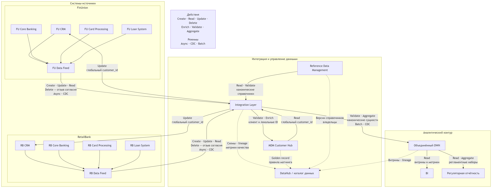

# Основные потоки данных

Диаграмма промежуточного состояния: [`diagrams/data-flow-level-0.mmd`](diagrams/data-flow-level-0.mmd).

## Принципы

1. Integration Layer транспортирует, валидирует и маршрутизирует данные, но не становится их владельцем.
2. Изменения публикуются идемпотентно с ключом `source_system + source_id + source_event_version`.
3. Финансовые события передаются через CDC или асинхронные сообщения. Аналитические потребители не читают рабочие таблицы OLTP.
4. Batch применяется для сверенных срезов, исторической загрузки и регламентированных выгрузок.
5. Ошибочная запись не теряется. Она поступает в карантин с причиной, источником и correlation ID.
6. `Delete` для согласий означает отзыв. Для финансовых фактов и договоров используется закрытие или новая версия без физического удаления.

## Каталог потоков

| ID | Источник | Приёмник | Передаваемые сущности | Действие | Режим | Назначение |
|---|---|---|---|---|---|---|
| F01 | FU CRM | Integration Layer | • Клиент  • Обращение  • Заявка  • Согласие  • Метаданные документа | • Create  • Update  • Delete для отзыва согласия | Async | Передать клиентские изменения FU в общий контур без синхронной зависимости CRM от MDM и DWH |
| F02 | RB CRM | Integration Layer | • Клиент  • Обращение  • Заявка  • Согласие  • Метаданные документа | • Create  • Update  • Delete для отзыва согласия | Async | Подключить RB к общему идентификатору и отчётности без замены CRM |
| F03 | FU Core Banking | Integration Layer | • Счёт  • Договор  • Платёж  • Операция  • Контрагент | • Create  • Update  • Read | CDC | Публиковать изменения операционного учёта FU без аналитических запросов к Core |
| F04 | RB Core Banking | Integration Layer | • Счёт  • Договор  • Платёж  • Операция  • Контрагент | • Create  • Update  • Read | CDC | Включить финансовые данные RB в общий контур при сохранении RB Core мастером своего портфеля |
| F05 | FU Card Processing | Integration Layer | • Карта  • Карточная операция | • Create  • Update  • Read | CDC | Передавать статусы карт и токенизированные операции FU |
| F06 | RB Card Processing | Integration Layer | • Карта  • Карточная операция | • Create  • Update  • Read | CDC | Передавать статусы карт и токенизированные операции RB без раскрытия PAN |
| F07 | FU Loan System | Integration Layer | • Кредит  • График  • Задолженность  • Кредитная заявка | • Create  • Update  • Read | CDC | Получать актуальный кредитный портфель FU и изменения просрочки |
| F08 | RB Loan System | Integration Layer | • Кредит  • График  • Задолженность  • Кредитная заявка | • Create  • Update  • Read | CDC | Получать актуальный кредитный портфель RB на общей бизнес-дате |
| F09 | Integration Layer | MDM Customer Hub | • Клиент  • Локальные идентификаторы  • Контакты  • KYC-атрибуты | • Validate  • Enrich  • Create  • Update | Async | Выполнить нормализацию, match/merge и сформировать золотую запись |
| F10 | MDM Customer Hub | Integration Layer | • Глобальный `customer_id`  • Результат матчинга  • Разрешённые золотые атрибуты | • Read  • Enrich | Async | Распространить единый идентификатор и подтверждённые клиентские атрибуты |
| F11 | Integration Layer | FU/RB CRM | • Глобальный `customer_id`  • Таблица соответствий  • Статус матчинга | Update | Async | Связать локальные CRM-профили с золотой записью и показать конфликт на ручную обработку |
| F12 | Reference Data Management | Integration Layer | • Канонические коды  • Маппинг FU/RB  • Версии и периоды действия | • Read  • Validate  • Enrich | Async при публикации версии | Нормализовать статусы, валюты, типы продуктов, каналов и операций |
| F13 | Integration Layer | Объединённый DWH | • Клиент  • Счёт  • Договор  • Продукт  • Карта  • Кредит  • Платёж  • Операция  • Обращение | • Validate  • Aggregate  • Create  • Update | • CDC для изменений  • Batch для сверенного среза | Построить единые факты и измерения с lineage до FU/RB-источника |
| F14 | Объединённый DWH | BI | • Витрины клиентов  • Витрины счетов  • Продуктовые и операционные метрики | • Read  • Aggregate | Batch после закрытия окна загрузки | Обеспечить согласованную управленческую отчётность без нагрузки на OLTP |
| F15 | Объединённый DWH | Регуляторная отчётность | • Сверенные финансовые факты  • Датированные остатки  • Кредитный портфель | • Read  • Aggregate | Регламентный batch | Сформировать воспроизводимый набор с зафиксированной бизнес-датой и версией правил |
| F16 | Integration Layer, MDM, RDM и DWH | DataHub / каталог данных | • Схемы  • Владельцы  • Lineage  • Метрики качества  • SLA | • Create  • Update | Async и плановый сбор метаданных | Сделать происхождение, качество и ответственность доступными для аудита и эксплуатации |

## Выбор режима обмена

### Async

Используется для клиентских изменений, глобального идентификатора и справочников. Источник не блокируется при временной недоступности потребителя. Очередь обеспечивает повторную доставку, порядок в пределах ключа сущности и Dead Letter Queue.

### CDC

Используется для Core, Cards и Loans. CDC уменьшает нагрузку на OLTP и сохраняет порядок изменений. Он не заменяет бизнес-события, поэтому технические изменения фильтруются и преобразуются в версионированный контракт.

### Batch

Используется для сверенных срезов, BI и регуляторных наборов. Публикация начинается только после проверки полноты, количества записей и финансовых сумм. Каждый пакет имеет `batch_id`, бизнес-дату и версию преобразования.

### Синхронный обмен

В DFD промежуточного состояния синхронная запись между FU и RB не применяется. Синхронный `Read` допустим только для пользовательского запроса, где устаревание данных недопустимо и определены timeout, circuit breaker и безопасная деградация.

### Streaming

Потоковая доставка может использоваться транспортом для событий с высокой частотой. Для трёхмесячного горизонта она не является самостоятельной целью. Приоритет отдан надёжному CDC и асинхронной доставке с контролем качества.
