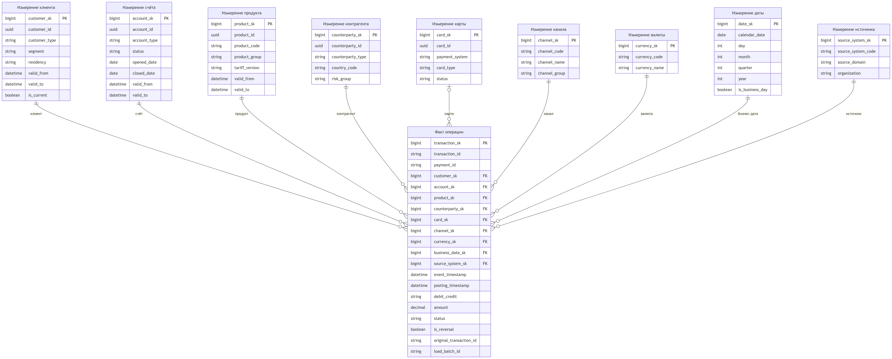

# Аналитическая модель Payments & Transactions

Диаграмма: [`diagrams/transactions-star-schema.mmd`](diagrams/transactions-star-schema.mmd).


## Выбранная модель

Используется схема **«звезда»**. Центральная таблица `fact_transactions` содержит одну подтверждённую финансовую операцию в гранулярности исходной проводки. Измерения хранят аналитический контекст, действовавший на момент операции.

Платёж и операция не объединяются:

- `payment_id` является бизнес-ссылкой на распоряжение.
- `transaction_id` идентифицирует отдельный финансовый факт.
- один платёж может породить несколько строк факта.
- комиссия, процент или служебная проводка может не иметь `payment_id`.
- сторно является отдельной строкой со ссылкой `original_transaction_id`.

## Гранулярность

**Одна строка `fact_transactions` = одна проведённая операция из конкретной системы-источника.**

Уникальность определяется комбинацией:

```text
source_system_code + transaction_id + source_event_version
```

Агрегирование на этапе загрузки запрещено. Это позволяет пересчитать обороты, расследовать расхождения и построить разные витрины без потери исходной детализации.

## Таблицы

| Тип таблицы | Таблица | Назначение | Ключевые поля |
|---|---|---|---|
| Fact | `fact_transactions` | Неизменяемые финансовые операции всех доменов | • `transaction_sk`<br><br>• `transaction_id`<br><br>• `payment_id`<br><br>• ссылки на измерения<br><br>• `amount`<br><br>• `debit_credit`<br><br>• `posting_timestamp`<br><br>• `is_reversal` |
| Dimension | `dim_customer` | Аналитический профиль клиента без избыточных ПДн | • `customer_sk`<br><br>• `customer_id`<br><br>• тип<br><br>• сегмент<br><br>• резидентство<br><br>• период версии |
| Dimension | `dim_account` | Счёт, его тип и статус на момент операции | • `account_sk`<br><br>• `account_id`<br><br>• тип<br><br>• статус<br><br>• даты открытия и закрытия<br><br>• период версии |
| Dimension | `dim_product` | Канонический продукт и версия тарифа | • `product_sk`<br><br>• `product_id`<br><br>• группа<br><br>• `tariff_version`<br><br>• период версии |
| Dimension | `dim_counterparty` | Нормализованный контрагент для платёжной и риск-аналитики | • `counterparty_sk`<br><br>• `counterparty_id`<br><br>• тип<br><br>• страна<br><br>• риск-группа |
| Dimension | `dim_card` | Токенизированный карточный контекст | • `card_sk`<br><br>• `card_id`<br><br>• платёжная система<br><br>• тип карты<br><br>• статус |
| Dimension | `dim_channel` | Канал инициирования операции | • `channel_sk`<br><br>• код<br><br>• название<br><br>• группа |
| Dimension | `dim_currency` | Канонический справочник валют | • `currency_sk`<br><br>• ISO-код<br><br>• название |
| Dimension | `dim_date` | Календарная и банковская дата | • `date_sk`<br><br>• дата<br><br>• месяц<br><br>• квартал<br><br>• год<br><br>• признак рабочего дня |
| Dimension | `dim_source_system` | Lineage до организации, системы и домена | • `source_system_sk`<br><br>• код системы<br><br>• `source_domain`<br><br>• FU/RB |

## Меры

| Мера | Формула | Правило использования |
|---|---|---|
| Сумма операций | `SUM(amount)` | Группировать по валюте либо пересчитывать по утверждённому курсу на бизнес-дату |
| Количество операций | `COUNT(transaction_sk)` | Сторно считается отдельной операцией |
| Чистый оборот | `SUM(CASE debit_credit ...)` | Знак определяется бухгалтерским направлением, а не знаком исходного числа |
| Сумма сторно | `SUM(amount) WHERE is_reversal = true` | Анализируется отдельно от обычного оборота |
| Средний чек | `SUM(amount) / COUNT(*)` | Рассчитывается после фильтрации валюты, статуса и типа операции |
| Доля карточных операций | Количество или сумма карточного `source_domain` / общий показатель | `source_domain` обязателен для унификации Core, Cards и Loans |

Баланс счёта не вычисляется простым суммированием без учёта начального остатка, валюты, business date и полного набора проводок. Для баланса используется отдельный сверенный snapshot-факт.

## Slowly Changing Dimensions

| Измерение | Тип | Причина |
|---|---|---|
| `dim_customer` | SCD Type 2 | Сегмент, резидентство и разрешённые аналитические признаки меняются во времени |
| `dim_account` | SCD Type 2 | Статус и классификация счёта должны соответствовать моменту операции |
| `dim_product` | SCD Type 2 | Требуется воспроизводить тариф и условия, действовавшие на дату |
| `dim_counterparty` | SCD Type 2 для классификации<br><br>Snapshot-реквизиты остаются в платёжном факте или защищённом detail-слое | Текущий реестр не должен менять исторический смысл операции |
| `dim_card` | SCD Type 2 | Статусы выпуска, блокировки и перевыпуска имеют временную семантику |
| Справочные измерения | SCD Type 1 или Type 2 по политике набора | Исправление опечатки может быть Type 1. Изменение смысла требует Type 2 |

Surrogate key выбирается по интервалу:

```text
event_business_time >= valid_from
AND event_business_time < valid_to
```

## Поздние факты и измерения

1. Если факт поступил после закрытия дня, он загружается с исходной business date и текущим `load_batch_id`.
2. Затронутые партиции и агрегаты пересчитываются.
3. Если измерение ещё не известно, используется специальный surrogate key `Unknown`.
4. После появления измерения выполняется контролируемый re-key фактов.
5. Изменение сертифицированного периода создаёт новую версию отчётного набора и аудит причины.

## Контроль качества

- уникальность natural key операции в пределах источника.
- наличие счёта, валюты, бизнес-даты и системы-источника.
- допустимые значения `debit_credit`, статуса и `source_domain`.
- связь сторно с существующей исходной операцией.
- соответствие суммы точности валюты.
- отсутствие полного PAN и открытых идентификационных данных клиента.
- сверка количества и сумм с Accounting Ledger по источнику, валюте и бизнес-дате.
- доля `Unknown` измерений ниже согласованного порога.

## Почему звезда подходит

1. BI-запросы используют короткие и понятные join-пути.
2. Общие измерения обеспечивают одинаковые определения клиента, продукта, канала и даты.
3. Surrogate keys позволяют корректно привязать факт к исторической версии.
4. Новые измерения и меры добавляются без изменения гранулярности факта.
5. Модель хорошо поддерживает агрегации по времени, клиенту, продукту, каналу и источнику.
6. Простая структура облегчает контроль доступа, lineage и объяснение показателей.

Снежинка не выбрана как основная модель, потому что дополнительные уровни нормализации увеличат количество join и усложнят BI. Иерархии продукта, страны и календаря остаются атрибутами измерений, пока их размер и независимое управление не потребуют выделения.

## Граница факта при росте

`fact_transactions` содержит только проведённые финансовые операции, которые влияют на учёт или подтверждённый оборот.

В таблицу не включаются:

- карточные авторизации до клиринга.
- технические попытки платежа.
- промежуточные статусы workflow.
- события просмотра и навигации канала.

Эти события остаются в Iceberg и доступны через отдельные curated datasets. Если карточные авторизации становятся регулярным BI-сценарием, создаётся `fact_card_authorizations` с общей `dim_card`, `dim_customer`, `dim_channel`, `dim_date` и `dim_source_system`.

Такое разделение предотвращает рост основного факта за счёт событий другой гранулярности и не смешивает near-line Anti-fraud с сертифицированным финансовым учётом.

## Partitioning и жизненный цикл

| Горизонт использования | Размещение | Правило |
|---|---|---|
| Актуальный hot period | PostgreSQL `fact_transactions` | • Партиционирование по business date<br><br>• Индексы по surrogate keys<br><br>• BI через read replica при необходимости |
| Полная история | Iceberg curated | • Hidden partitioning по business date и domain<br><br>• Детальные операции всех периодов<br><br>• Доступ через Trino |
| Частые агрегаты | PostgreSQL aggregate marts | • День, месяц, продукт, канал и валюта<br><br>• Lineage до детального snapshot |
| Закрытый архив | Iceberg cold tier | • Неизменяемые snapshots<br><br>• Более дешёвый storage class<br><br>• Восстановление по запросу |

Конкретная длина hot period определяется измеренным профилем запросов. Перенос периода не меняет logical view для consumer.

## Стратегия SCD при росте

SCD Type 2 не применяется ко всем изменяемым атрибутам автоматически.

- в DWH историзируются только признаки, которые меняют смысл аналитического среза.
- высокочастотные технические атрибуты остаются в Iceberg history.
- часто меняющиеся независимые признаки могут быть вынесены в mini-dimension.
- массовый MDM merge не создаёт новую клиентскую версию без изменения аналитически значимого атрибута.
- неактуальные версии измерений остаются доступны для point-in-time join.

Триггером пересмотра служит рост количества версий на business key и ухудшение p95 join при стабильном объёме фактов.

## Point-in-time certification

Каждая сертифицированная публикация получает `report_snapshot_id` и manifest:

| Поле | Назначение |
|---|---|
| `report_snapshot_id` | Неизменяемый идентификатор опубликованной версии |
| `dwh_batch_id` | Batch, сформировавший факты и измерения |
| `iceberg_snapshot_ids` | Версии curated-источников |
| `rdm_version` | Версия справочников |
| `mdm_as_of` | Срез golden record |
| `business_date` | Отчётная бизнес-дата |
| `quality_result_id` | Результат проверок и reconciliation |
| `published_at` | Время публикации |
| `approved_by` | Подтверждение владельца по процедуре |

Повторный выпуск создаёт новый `report_snapshot_id` и ссылку на заменённую версию. Старый manifest не перезаписывается.

## Триггеры эволюции модели

| Сигнал | Возможная причина | Решение |
|---|---|---|
| P09 не укладывается в batch window | Слишком большой hot fact | • Сократить hot window<br><br>• Загружать агрегаты<br><br>• Перенести drill-down в Trino |
| p95 BI-запросов растёт | Scan detail и SCD joins | • Read replica<br><br>• Materialized aggregates<br><br>• Mini-dimensions |
| Поздние факты часто открывают закрытые периоды | Недостаточное lateness window | • Two-phase certification<br><br>• Отдельный late-fact pipeline<br><br>• Пересмотр EOD calendar |
| Доля `Unknown` растёт | Измерения отстают от фактов | • Ускорить MDM/RDM flow<br><br>• Отложить certification домена<br><br>• Controlled re-key |
| Карточные авторизации доминируют по объёму | Смешение гранулярностей | Создать отдельный `fact_card_authorizations` и общие conformed dimensions |
