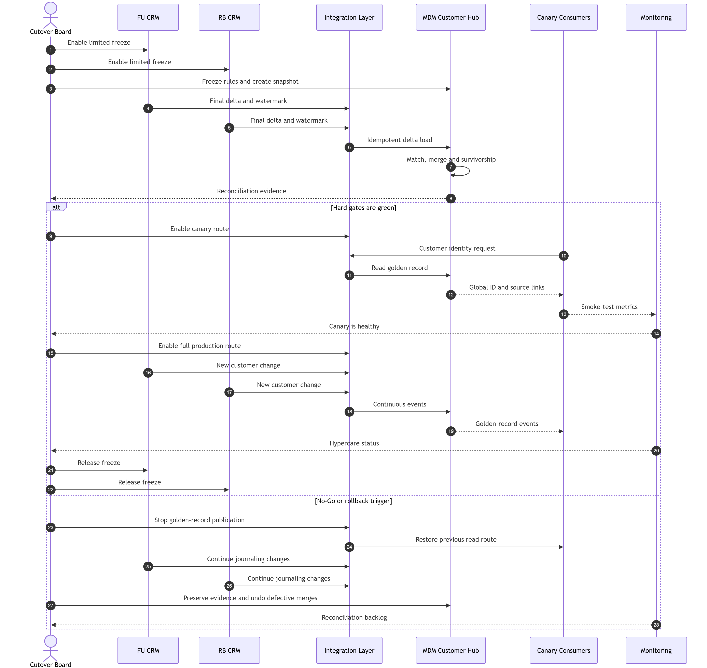

# Cutover-план клиентских данных

## Цель и объект переключения

Cutover переводит потребителей клиентской идентичности на MDM Customer Hub:

- MDM становится мастером глобального `customer_id`, golden record и source links.
- FU/RB CRM продолжают принимать изменения профиля и обслуживать обращения.
- CRM публикуют изменения через Integration Layer.
- MDM распространяет версионированные golden-record events.
- Customer 360 использует MDM как источник идентичности.

Переключение не переносит в MDM счета, платежи, задолженность или финансовые проводки.

Диаграмма: [`diagrams/customer-cutover.mmd`](diagrams/customer-cutover.mmd).

## Стратегия

Применяется shadow → dual run → canary → full switch:

1. **Shadow:** MDM получает копию изменений, но не влияет на production consumers.
2. **Dual run:** ответы MDM сравниваются с FU/RB CRM и утверждённым mapping.
3. **Canary:** выбранные внутренние consumers читают идентичность из MDM.
4. **Full switch:** API routing и subscriptions переводятся на MDM.
5. **Hypercare:** расширенный мониторинг до закрытия rollback window.

Canary не включает массовые маркетинговые кампании и необратимые решения по клиенту.

## Роли

| Роль | Ответственность |
|---|---|
| Cutover Manager | Runbook, расписание, war room, решение о паузе |
| Customer Data Owner | Семантика, quality thresholds, business Go/No-Go |
| MDM Product Owner | Готовность MDM, match/merge, split и survivorship |
| CRM Owners FU/RB | Source snapshots, delta, ограничения изменений, fallback |
| Integration Owner | Kafka, API routing, Schema Registry, offsets и DLQ |
| Data Steward Lead | Разбор ambiguous matches и ручное подтверждение |
| Security Officer | Доступ, ПДн, audit и массовые операции |
| SRE/Operations | Capacity, monitoring, backup, restore и on-call |
| Consumer Owners | Canary, функциональная проверка и подтверждение switch |

Окончательное решение Go/No-Go принимают Customer Data Owner, Cutover Manager, MDM Product Owner и Operations. Любой из Security Officer или CRM Owners может объявить No-Go при угрозе потери или неправомерного раскрытия данных.

## Scope данных

В cutover входят:

- source customer IDs FU и RB.
- ФИО и нормализованные варианты.
- дата рождения.
- идентификаторы и разрешённые KYC-атрибуты.
- контакты и адреса.
- сегмент.
- согласия и их версии.
- source links.
- match confidence, survivorship provenance и audit history.

Документы мигрируются отдельным потоком. В MDM хранится ссылка, metadata и checksum, но не незащищённое бинарное содержимое.

## Подготовка

### T-30 — T-14 дней

- Зафиксировать scope, owners и consumer registry.
- Провести production-like rehearsal на копии полного объёма.
- Проверить capacity MDM, Kafka, API Gateway и Steward queue.
- Проверить backup и восстановление MDM, CRM mapping и Kafka offsets.
- Проверить split/undo merge.
- Закрыть critical defects из rehearsal.
- Подтвердить retention и доступ к ПДн.
- Обучить Service Desk и on-call.

### T-7 — T-2 дня

- Выполнить initial load и включить постоянную delta.
- Сравнить source counts, unique source IDs и attribute completeness.
- Разобрать ambiguous matches выше операционного порога очереди.
- Зафиксировать версии match rules, survivorship, schema и RDM.
- Подтвердить canary consumers и fallback configuration.
- Запретить несовместимые schema changes.
- Подготовить change tickets и коммуникацию.

### T-1 день

- Получить формальный readiness sign-off.
- Проверить отсутствие critical incidents.
- Снизить необязательную batch-нагрузку.
- Зафиксировать baseline dashboards.
- Выполнить последний rollback rehearsal без изменения production routing.

## Data freeze

Бизнес-операции с клиентами полностью не останавливаются. Ограниченный freeze действует от T-2 часа до завершения primary validation.

В период freeze запрещены:

- массовая очистка и bulk update клиентских профилей.
- изменение match/merge и survivorship rules.
- изменение canonical schema и RDM codes.
- ручной merge/split вне cutover queue.
- миграция новых consumers.
- запуск массовой коммуникации по MDM-сегменту.

Обычное изменение профиля в CRM разрешено. Оно записывается в source OLTP и попадает в финальную delta через outbox, event или CDC.

Экстренное исправление согласия или KYC выполняется по break-glass процедуре, журналируется и включается в отдельный reconciliation list.

## Runbook переключения

| ID | Время | Шаг | Действие | Контроль | Owner |
|---|---|---|---|---|---|
| C01 | T-120 мин | Открыть war room | • Проверить участников  • Зафиксировать change window  • Остановить некритические jobs | Все роли на связи | Cutover Manager |
| C02 | T-110 мин | Включить freeze | • Заблокировать bulk update  • Зафиксировать версии rules и schemas | Freeze audit event | CRM и MDM Owners |
| C03 | T-100 мин | Создать recovery points | • Snapshot MDM  • Backup mappings  • Kafka offsets  • API config export | Restore points читаются и имеют checksum | Operations |
| C04 | T-90 мин | Зафиксировать source watermarks | • FU CRM watermark  • RB CRM watermark  • Break-glass list | Watermarks записаны в cutover manifest | Integration Owner |
| C05 | T-80 мин | Получить final delta | • Вычитать изменения после initial load  • Повторить transient errors  • Изолировать poison messages | Нет необъяснимого gap по sequence | Integration Owner |
| C06 | T-60 мин | Загрузить delta в MDM | • Идемпотентный upsert  • Применить frozen rule version  • Сохранить provenance | Все принятые source records имеют processing result | MDM Product Owner |
| C07 | T-40 мин | Выполнить reconciliation | • Record count  • Source links  • Контакты  • KYC  • Согласия  • Duplicate clusters | Все hard gates зелёные | Customer Data Owner |
| C08 | T-25 мин | Принять Go/No-Go | • Рассмотреть controls и incidents  • Подписать решение | Решение и участники записаны | Cutover Board |
| C09 | T-20 мин | Включить canary | • Переключить внутренний Customer Service segment  • Включить golden events только canary consumers | Error rate и latency в SLO | Integration Owner |
| C10 | T-5 мин | Проверить canary | • Найти клиентов FU, RB и matched profile  • Проверить consent и source navigation | Business smoke tests успешны | Consumer Owners |
| C11 | T0 | Full switch | • Переключить API routing  • Активировать subscriptions  • Сохранить старый route disabled, но recoverable | Новые запросы используют MDM | Cutover Manager |
| C12 | T+15 мин | Primary validation | • End-to-end update из обеих CRM  • Event freshness  • Queue и DLQ  • Audit | Нет rollback trigger | MDM и Integration Owners |
| C13 | T+30 мин | Снять freeze | • Разрешить обычные ручные операции  • Bulk jobs оставить выключенными | Customer Data Owner подтверждает | Cutover Manager |
| C14 | T+2 часа | Operational sign-off | • Проверить consumers  • Разобрать все alerts  • Сохранить evidence | Primary controls зелёные | Operations |
| C15 | T+24 часа | Business sign-off | • Сравнить daily profile  • Проверить жалобы и false merge  • Оценить Steward backlog | Backlog и quality в SLO | Customer Data Owner |
| C16 | T+7 дней | Закрыть rollback window | • Подтвердить stable operations  • Перевести legacy read path в controlled fallback | Migration Board approval | Cutover Manager |

Фактическое время меняется после rehearsal. Последовательность и контрольные ворота остаются обязательными.

## Многоуровневая валидация

Общая методика описана в [`data-validation.md`](data-validation.md). Customer cutover проверяет не только количество записей, но также completeness, validity, uniqueness, source links, MDM match quality, temporal consistency, consent/KYC и end-to-end delivery.

| Контроль | Hard gate | Метод |
|---|---|---|
| Source completeness | Каждая запись из final watermarks имеет результат `matched`, `new`, `rejected` или `quarantined` | Сравнение manifest и MDM processing log |
| Source ID uniqueness | Один `source_system + source_customer_id` связан не более чем с одним active global ID | Unique constraint и exception report |
| Lost delta | Не допускается необъяснимый sequence gap | Watermark и offset reconciliation |
| Golden ID uniqueness | Нет двух active golden records с одним утверждённым идентификатором | MDM constraint и duplicate scan |
| False merge | Ни один подтверждённый critical false merge.  Общая доля ниже утверждённого порога | Golden sample, deterministic checks и Steward review |
| KYC completeness | Не хуже исходного baseline по обязательным атрибутам | Attribute profile по source и golden |
| Consent | Последняя версия, цель, срок и отзыв совпадают | Point-in-time comparison |
| Contacts | Количество valid primary contacts не ниже baseline | Normalized contact report |
| Event delivery | Golden event до consumer не превышает 5 минут в нормальном режиме | End-to-end timestamp |
| Audit | Каждое merge/split и изменение survivorship имеет actor, rule version и timestamp | Audit query |

Rejected и quarantined записи допустимы только при назначенном owner и отсутствии влияния на hard gate.

| Записи Customer cutover | Data Steward | Producer Owner | Решение |
|---|---|---|---|
| FU CRM customer records | Customer Data Steward FU | FU CRM Owner | Исправить источник, подтвердить replay или оставить отдельный global ID |
| RB CRM customer records | Customer Data Steward RB | RB CRM Owner | Исправить источник, подтвердить replay или оставить отдельный global ID |
| Неоднозначный cross-bank match | Lead Customer Data Steward | MDM Product Owner | Merge, split, manual review или отдельные golden records |
| Consent и KYC conflict | Consent/KYC Data Steward | CRM Owner соответствующего источника | Исправление только с Compliance approval |

Customer Data Owner accountable за итоговое решение и нарушение cutover SLA. MDM Platform Owner отвечает за сохранность, audit и повторную обработку записи, но не выбирает корректное бизнес-значение.

## Go/No-Go

### Go

- Все hard gates зелёные.
- Нет Severity 1 или Severity 2 инцидента.
- Delta lag находится в согласованном окне.
- Steward backlog не превышает доступную мощность hypercare.
- Canary smoke tests успешны.
- Backup и fallback route доступны.
- Business и technical owners подписали решение.

### No-Go

- Есть потерянная delta или необъяснимый gap.
- Обнаружен critical false merge.
- Неверно обработан отзыв согласия.
- MDM, Kafka или API не имеют эксплуатационного резерва.
- Не работает audit или field-level security.
- Rollback route недоступен.

No-Go возвращает процесс к shadow или dual run. Календарный срок не отменяет hard gate.

## Фолбэк

### Триггеры

| Триггер | Порог решения |
|---|---|
| Недоступность MDM/API | Нарушение утверждённого availability SLO и отсутствие быстрого восстановления |
| Потеря или дублирование delta | Любое необъяснимое нарушение hard gate |
| Critical false merge | Любой подтверждённый случай с риском обслуживания не того клиента |
| Consent/KYC defect | Любое неверное разрешение доступа или коммуникации |
| Event lag | Устойчивое превышение SLO и рост backlog |
| Security incident | Подтверждённый неавторизованный доступ или утечка |

### Порядок rollback

1. Остановить новые MDM golden-record events для production consumers.
2. Перевести API routing на предыдущее CRM/source-link представление.
3. Не отключать приём изменений из CRM. Сохранять их в Kafka и immutable journal.
4. Зафиксировать MDM snapshot, offsets и defect evidence.
5. Отменить только созданные MDM merge через split/undo merge.
6. Не откатывать бизнес-изменения, принятые CRM после T0.
7. Восстановить mapping из recovery point при повреждении.
8. Выполнить reconciliation CRM changes с накопленным journal.
9. Сообщить consumers статус, `as_of_timestamp` и ограничения.
10. Вернуться в dual run после устранения причины и нового rehearsal.

Rollback меняет маршрут чтения и распространения идентичности. Он не выполняет database rollback FU/RB CRM и не удаляет события.

## Точка необратимости

Внутри первичного cutover технической точки необратимости нет. Старый read route сохраняется recoverable до T+7 дней.

После закрытия rollback window возврат считается отдельной миграцией, если:

- legacy mapping больше не поддерживается.
- consumer начал хранить только global `customer_id`.
- завершён decommission исходного маршрута.

До этих действий Migration Board обязан сохранить tested fallback.

## Мониторинг hypercare

| Метрика | Окно | Реакция |
|---|---|---|
| API availability и p95 | 1 минута | Автоматический alert и оценка rollback |
| Golden event freshness | 1–5 минут | Масштабировать consumer, проверить hot key и DLQ |
| Kafka lag и DLQ | 1 минута | Остановить switch следующего consumer |
| MDM match rate | 15 минут | Сравнить с baseline и rule version |
| False merge / split | Near real time и daily | Немедленно остановить auto-merge при hard trigger |
| Steward backlog | Ежечасно | Уменьшить auto-match scope или добавить capacity |
| Consent/KYC exceptions | Near real time | Security и Compliance review |
| Consumer errors | 5 минут | Canary pause или route fallback |
| Customer complaints | Ежечасно в рабочее время | Связать с global ID и приоритизировать investigation |

Hypercare действует минимум семь дней и продлевается при незакрытом Severity 2 инциденте или нестабильном quality trend.

## Коммуникации

- T-7 дней: уведомление владельцев и Service Desk.
- T-1 день: подтверждение окна и ограниченного freeze.
- T0: сообщение о начале и результате switch.
- При rollback: немедленное сообщение с affected consumers и `as_of_timestamp`.
- T+24 часа: business status.
- T+7 дней: решение о завершении hypercare и rollback window.
