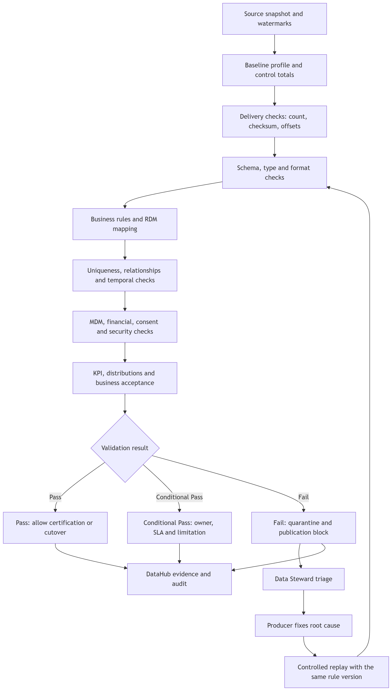

# Валидация данных при миграции

## Цель

Валидация подтверждает не только доставку всех записей, но и сохранение бизнес-смысла, истории, связей и качества после преобразования.

Равенство `source count = target count` недостаточно. Одинаковое количество записей может скрывать:

- неверное сопоставление клиентов.
- потерю обязательных атрибутов.
- изменение суммы или валюты.
- нарушение связей между клиентом, договором и счётом.
- применение неправильной версии справочника.
- потерю истории и temporal semantics.
- неверную обработку согласия, KYC или сторно.
- появление дублей при повторной загрузке.

Диаграмма: [`diagrams/data-validation-flow.mmd`](diagrams/data-validation-flow.mmd).

## Принципы

- Проверки определяются до initial load и версионируются вместе с data contract.
- Source baseline фиксируется до преобразования.
- Critical validation выполняется автоматически для каждой migration wave.
- Business Data Owner утверждает пороги и допустимые исключения.
- Data Steward анализирует дефекты и владеет карантинной очередью.
- Producer Owner исправляет причину в авторитетном источнике.
- Проверка выполняется на уровне записей, агрегатов и распределений.
- Исправление не перезаписывает immutable raw.
- Повторный запуск использует тот же source cut, rule version и reference-data version.
- Результат валидации сохраняется как evidence для G2, G3, G4 и G5.

## Уровни валидации

| Уровень | Что проверяется | Примеры | Возможный результат |
|---|---|---|---|
| Техническая доставка | Полнота файлов, сообщений и диапазонов CDC | • Record count  • File checksum  • Kafka offsets  • CDC LSN  • Watermark gap  • Повторная доставка | Pass, replay или остановка загрузки |
| Структура | Соответствие схеме и типам | • Обязательные поля  • Тип данных  • Длина  • Precision/scale  • Encoding  • Schema version | Pass или quarantine |
| Синтаксис | Формальная корректность значения | • Формат даты  • Телефон  • Email  • Идентификатор  • Код валюты  • MIME type | Pass, normalize или quarantine |
| Семантика | Допустимость значения в бизнес-контексте | • Сумма больше нуля для заданного типа операции  • Допустимый статус  • Возраст и дата рождения  • Версия продукта действует на дату договора | Pass, business review или block |
| Справочники | Соответствие RDM и исторической версии | • Local-to-canonical mapping  • Период действия кода  • Отсутствие unknown для mandatory code | Pass или quarantine до mapping |
| Уникальность | Отсутствие технических и бизнес-дублей | • Source key  • Idempotency key  • Global customer ID  • Номер договора в области действия | Pass, dedup или Steward review |
| Ссылочная целостность | Существование связанных сущностей | • Счёт → клиент  • Договор → продукт  • Карта → счёт  • Кредит → договор  • Сторно → исходная операция | Pass, quarantine или publication block |
| Temporal consistency | Корректность порядка и периодов | • `valid_from < valid_to`  • Нет пересечения SCD-версий  • Статусы идут в разрешённом порядке  • Business date согласована | Pass, reorder, replay или block |
| Финансовая сверка | Сохранение учётного результата | • Debit = credit  • Суммы по валюте  • Остаток и обороты  • Выдачи и погашения  • Сторно | Pass или hard block |
| MDM-качество | Корректность identity resolution | • False merge  • False non-match  • Source links  • Match confidence  • Survivorship provenance | Auto-accept, Steward review или No-Go |
| Privacy и compliance | Законность и минимизация обработки | • Consent version  • KYC completeness  • PAN tokenization  • PII masking  • Retention и legal hold | Pass, security quarantine или hard block |
| Аналитическая эквивалентность | Сохранение показателей и распределений | • Business KPI  • Суммы по продуктам  • Null rate  • Cardinality  • Distribution drift  • Top categories | Pass, investigation или продление dual run |
| Бизнес-приёмка | Корректность реальных сценариев | • Customer 360  • Выписка  • Портфель  • Регуляторный отчёт  • Drill-down до source | Sign-off или No-Go |

## Валидация по этапам миграции

### 1. До миграции: baseline

Для каждого source dataset фиксируются:

- точный source cut и business date.
- количество записей и distinct business keys.
- null rate обязательных и ключевых атрибутов.
- duplicate rate.
- минимумы, максимумы и допустимые диапазоны.
- распределения по статусам, продуктам, валютам и источникам.
- количество orphan records.
- финансовые суммы и остатки.
- версии RDM, MDM rules и схем.
- известные дефекты, принятые Data Owner.

Baseline подписывают Data Owner, Data Steward и Producer Owner. Известный дефект источника не должен автоматически считаться дефектом миграции, но переносится в quality debt register.

### 2. При приёме в raw

Проверяется техническая неизменность:

- file checksum и размер.
- число сообщений или строк.
- последовательность offsets, LSN и watermarks.
- source ID, ingestion time и correlation ID.
- отсутствие необъяснимой потери или двойной поставки.
- возможность повторного чтения.

Raw сохраняет исходный payload даже при ошибке качества. Структурно нечитаемый объект изолируется, но не удаляется.

### 3. В standardized

Проверяются:

- schema contract.
- типы и форматы.
- обязательные поля.
- канонические идентификаторы.
- RDM mapping.
- дедупликация по source key и версии.
- нормализация времени, валют и кодировок.
- сохранение provenance до исходного payload.

Ошибка отдельной записи направляет её в доменный карантин. Массовая ошибка схемы останавливает обработку всей несовместимой версии.

### 4. В curated

Проверяются бизнес-правила:

- уникальность и жизненный цикл сущности.
- ссылки между сущностями.
- temporal consistency.
- MDM match/merge.
- financial reconciliation.
- consent, KYC и security classification.
- соответствие data-product contract.

Curated dataset получает статус `Provisional`, пока не завершены все проверки, необходимые для `Certified`.

### 5. В DWH и BI

Проверяются:

- гранулярность факта.
- SCD point-in-time join.
- отсутствие необъяснимого `Unknown` dimension key.
- соответствие curated snapshot и DWH batch.
- бизнес-метрики и аналитические распределения.
- drill-down отчёта до source record.
- воспроизводимость по `report_snapshot_id`.

Сравнение выполняется минимум для двух последовательных отчётных периодов до отключения legacy BI.

### 6. После cutover

Проверяются:

- новые записи из каждого источника.
- late events и replay.
- freshness и quarantine aging.
- жалобы и business exceptions.
- отсутствие обращений к retired route.
- стабильность качества относительно baseline.

Успешный cutover не закрывает дефекты автоматически. Нерешённые исключения переходят в BAU backlog с владельцем и SLA.

## Проверки по ключевым сущностям

| Сущность | Критические проверки качества | Hard gate |
|---|---|---|
| Клиент | • Уникальность source link и global ID  • Формат и непротиворечивость идентификаторов  • Полнота KYC  • Контакты  • False merge и false non-match  • Survivorship provenance | • Нет подтверждённого critical false merge  • Нет потерянной source record  • Все ambiguous records имеют Steward decision или карантин |
| Согласие | • Версия текста  • Цель  • Канал и время  • Срок  • Отзыв  • Evidence | Ни одно отозванное или просроченное согласие не становится активным |
| Счёт | • Уникальность ключа  • Валюта и статус  • Связь с клиентом и договором  • Остаток на business date | Нет orphan account.  Остатки и контрольные суммы совпадают |
| Договор | • Стороны  • Версия продукта  • Период действия  • Подписанный документ  • Жизненный цикл статуса | Нет active contract без клиента, продукта и действующей версии условий |
| Карта | • Уникальность токена  • Связь со счётом  • Статус и срок  • Авторизация и клиринг  • Отсутствие открытого PAN | PAN не покидает PCI-контур.  Нет active card без valid account link |
| Кредит | • Договор и счёт погашения  • График  • Остаток долга  • Выдачи и погашения  • Просрочка на business date | Остаток и график проходят кредитную и финансовую сверку |
| Платёж | • Source и idempotency keys  • Сумма и валюта  • Реквизиты  • Статусная цепочка  • Контрагент | Нет потерянного или двойного подтверждённого платежа |
| Операция | • Уникальность source key  • Debit/credit  • Business date  • Сторно  • Связь с платёжным или продуктовым фактом | Ненулевое финансовое расхождение блокирует Certified publication |
| Документ | • Checksum  • MIME type  • Антивирусная проверка  • Версия  • Связь с объектом  • Retention | Повреждённый, заражённый или несвязанный документ не публикуется |
| Справочное значение | • Канонический код  • Local mapping  • Период действия  • Непересекающиеся версии | Mandatory local code не публикуется без действующего canonical mapping |

## Сравнение source и target

Для каждого набора формируется validation manifest:

| Группа контроля | Source | Target | Сравнение |
|---|---|---|---|
| Объём | • Total rows  • Distinct keys  • Rows by partition | Те же показатели после учёта rejected и quarantined | `source = loaded + rejected + quarantined` |
| Контрольная сумма | Hash файла или детерминированный hash набора ключевых полей | Hash до и после преобразования по правилам mapping | Объяснимое отличие только для утверждённой нормализации |
| Полнота | Null и populated counts по critical fields | Те же counts и процент | Не хуже baseline без утверждённого исключения |
| Уникальность | Duplicate business keys | Duplicates после dedup и MDM | Не создаются новые необъяснимые дубли |
| Справочники | Частота local codes | Canonical codes и mapping version | Каждый mandatory code сопоставлен |
| Связи | Orphans по relationship | Orphans после global mapping | Новые orphan records запрещены |
| Время | Min/max event time, business date и version | Те же границы и temporal order | Нет потерянного периода или пересечения версий |
| Финансы | Count, amount, debit, credit, balances по валюте и business date | Те же показатели | Точное равенство для certified финансовых данных |
| Распределения | Status, product, channel, geography и amount bands | Те же распределения | Drift объяснён mapping rule или дефектом |
| Безопасность | PII/PAN classification и consent state | Маскирование, tokenization и policy | Не возникает более открытый класс доступа |

`Rejected` и `quarantined` не скрываются из формулы. Для каждой такой записи указываются причина, владелец и влияние на publication.

## Severity и решение

| Severity | Пример | Результат |
|---|---|---|
| Critical | • Финансовое расхождение  • Critical false merge  • Активировано отозванное согласие  • Раскрыт PAN  • Потеря delta | No-Go и Publication Block |
| High | • Orphan critical entity  • Неизвестный mandatory RDM code  • Нарушена история статусов | Quarantine affected records.  Go возможен только если Data Owner доказал изоляцию от cutover scope |
| Medium | • Необязательный атрибут хуже baseline  • Допустимое late event  • Некритичный descriptive mismatch | Исправление в согласованный SLA.  Data Owner принимает ограничение |
| Low | • Косметическое описание  • Неиспользуемый legacy attribute | Quality debt backlog с owner |

Порог устанавливается до запуска волны. Изменение порога после получения результата требует отдельного решения Data Owner и записи в audit.

## Решение Pass / Conditional Pass / Fail

### Pass

- Все critical и high checks пройдены.
- Source-target reconciliation замыкается.
- Карантин не содержит записей, влияющих на hard gate.
- Data Steward и Data Owner подписали результат.

### Conditional Pass

- Есть только изолированные medium/low defects.
- Для каждой записи или группы назначены owner и SLA.
- Consumer уведомлён об ограничении.
- Дефект не меняет финансовый, правовой или security-смысл.

### Fail

- Есть critical defect.
- Не замыкается формула полноты.
- Нет объяснения distribution drift.
- Записи карантина не имеют владельца.
- Невозможно воспроизвести проверку.

`Fail` означает No-Go для затронутой migration wave или data product.

## Автоматическая и ручная проверка

Автоматически проверяются:

- counts, hashes, duplicates и nulls.
- schema, types, formats и ranges.
- RDM mapping и referential integrity.
- temporal constraints.
- финансовые суммы и балансы.
- data drift и SLO.

Ручная проверка нужна для:

- неоднозначного MDM match.
- качества ФИО и адресов.
- юридического смысла согласия и договора.
- необычного distribution drift.
- business acceptance отчёта.

Ручная выборка использует риск-ориентированный подход:

- записи с низким match confidence.
- крупные финансовые суммы.
- редкие статусы и продукты.
- records после normalization.
- late и replayed events.
- записи, попавшие в карантин повторно.

Размер выборки и допустимый defect rate утверждаются Data Owner до G2.

## Ответственность

| Роль | Ответственность за валидацию |
|---|---|
| Data Owner | Утверждает правила, пороги, hard gates и итоговый Pass |
| Data Steward | Анализирует профиль, triage дефектов, управляет карантином и evidence |
| Producer Owner | Подтверждает source baseline и исправляет root cause |
| Migration Data Lead | Обеспечивает одинаковое выполнение правил между волнами |
| Data Quality Team | Реализует проверки, dashboards и versioning rules |
| Reconciliation Team | Выполняет финансовую и межсистемную сверку |
| Security / Compliance | Подтверждает privacy, consent, KYC, PCI и retention controls |
| Consumer Owner | Выполняет business acceptance и подтверждает пригодность |
| Platform Team | Обеспечивает исполнение, хранение результатов и replay |

## Evidence

Для каждой волны сохраняются:

- идентификатор source snapshot и watermarks.
- версии схем, mapping, RDM и quality rules.
- source и target profiles.
- результаты каждой проверки.
- список rejected и quarantined records с owners.
- объяснение каждого принятого расхождения.
- replay history.
- business sign-off.
- итоговый статус Pass, Conditional Pass или Fail.

Evidence регистрируется в DataHub и связывается с migration wave, data product, DWH batch и Iceberg snapshot.
