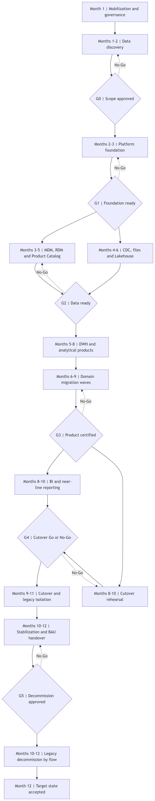

# Инкрементальный план миграции

## Подход

Миграция выполняется волнами по доменам и data products. Каждая волна проходит один и тот же цикл:

1. Инвентаризация и назначение владельца.
2. Контракт и canonical mapping.
3. Initial load в immutable raw.
4. Инкрементальная синхронизация.
5. Проверка качества и reconciliation.
6. Shadow и dual run.
7. Canary и переключение.
8. Hypercare и вывод старого маршрута.

Ни одна волна не ожидает завершения всех остальных доменов. Общие идентификаторы, справочники, безопасность и observability создаются раньше продуктовых миграций.

Диаграмма: [`diagrams/migration-roadmap.mmd`](diagrams/migration-roadmap.mmd).

Правила проверки: [`data-validation.md`](data-validation.md).

## План на 12 месяцев

| № | Период | Этап | Основные работы | Зависимости | Exit criteria | Результат | Accountable |
|---|---|---|---|---|---|---|---|
| 1 | Месяц 1 | Mobilization и governance | • Migration Board  • RACI  • Change control  • Data Owner и Steward  • Шаблоны evidence  • Общие определения SLA, RPO и RTO | Утверждённый scope объединения | • Назначены владельцы всех critical domains  • Утверждены decision rights  • Создан журнал рисков и зависимостей | Управляемая программа миграции | Executive Sponsor и Chief Data Officer |
| 2 | Месяцы 1–2 | Data discovery | • Реестр систем, таблиц, файлов и потоков  • Consumer registry  • Профилирование данных  • Поиск PII и PCI  • История объёмов и SLA  • Legal hold | Владельцы доступны для подтверждения | • 100% critical flows имеют owner  • Для legacy assets известны consumers  • Задокументированы business keys и retention | Baseline AS-IS и migration backlog | Enterprise Data Architect |
| 3 | Месяцы 2–3 | Platform foundation | • Среды dev/test/prod  • IAM и secrets  • Kafka и Schema Registry  • Airflow pools  • Object Storage и Iceberg Catalog  • DataHub  • Monitoring | Security architecture и capacity estimate | • HA smoke tests пройдены  • Backup/restore проверен  • Сквозной synthetic flow виден в lineage  • Доступ выдаётся по RBAC/ABAC | Готовая платформенная основа | Platform Owner |
| 4 | Месяцы 3–5 | Master data foundation | • RDM cross-mapping  • Product Catalog  • MDM canonical model  • Match/merge и survivorship  • Steward workflow  • Initial customer load | Discovery и platform foundation | • Critical codes имеют canonical mapping  • MDM quality thresholds утверждены  • Undo merge протестирован  • Customer 360 shadow доступен | Канонические идентификаторы и справочники | Customer Data Owner и Reference Data Owner |
| 5 | Месяцы 4–6 | Ingestion и Lakehouse | • CDC Core/Cards/Loans  • Managed file ingestion  • Raw, standardized, curated  • Dedup и quarantine  • Table maintenance  • Replay playbook | Platform foundation и source access | • Initial load и delta не имеют разрыва  • Record count сверён  • Каждая quarantine record имеет Data Steward и Producer Owner  • Aging и replay SLA наблюдаемы  • Replay выполнен на production-like объёме  • Compaction укладывается в окно | Полная управляемая история | Data Platform Owner за механизм.  Domain Data Owners за данные |
| 6 | Месяцы 5–8 | DWH и analytical products | • Conformed dimensions  • `fact_transactions`  • SCD  • Publication Gate  • Snapshot manifest  • Customer 360 и портфельные products | Curated data и master identifiers | • Финансовая сверка пройдена  • Point-in-time воспроизводим  • BI нагрузочный тест успешен  • P01 exit criteria выполнены по первой волне | Сертифицированная аналитика | Analytics Platform Owner и Finance Data Owner |
| 7 | Месяцы 6–9 | Доменные migration waves | • Волна Customer  • Accounts & Balances  • Payments & Transactions  • Cards Portfolio  • Loan Portfolio  • Documents и history | MDM, RDM, ingestion и quality gates | • Каждый product имеет contract и SLO  • Dual run пройден  • Consumer подтвердил switch  • Есть tested fallback | Домены переключены независимо | Domain Data Owners |
| 8 | Месяцы 8–10 | BI и near-line reporting | • Перенос отчётов по приоритету  • Согласование метрик  • Semantic layer  • Пятиминутные Provisional-витрины  • Обучение пользователей | Certified DWH и product contracts | • Два отчётных периода совпали  • Пятиминутный поток укладывается в freshness SLO  • Certified и Provisional явно разделены | Единые отчёты и оперативные витрины | BI Product Owner |
| 9 | Месяцы 9–11 | Cutover и legacy isolation | • Customer MDM cutover  • Переключение data routes  • Read-only legacy  • Consumer monitoring  • Архивирование конфигурации | Успешный rehearsal и Go/No-Go | • Post-cutover controls зелёные  • Нет необработанной delta  • Rollback window закрыт решением Board | Новые маршруты являются production path | Migration Manager |
| 10 | Месяцы 10–12 | Decommission и stabilization | • Отключение старых отчётов и migrated routes  • Архивы и retention  • Cost optimization  • DR exercise  • Передача в BAU | Hypercare завершён и consumers подтверждены | • Нет обращений к retired assets  • Restore drill пройден  • Runbooks приняты Operations  • Residual risks утверждены | Устойчивая эксплуатация целевой платформы | Operations Owner |

Периоды перекрываются только там, где есть независимые команды и формально завершённый входной gate.

## Обязательный validation gate

Перед dual run, consumer switch и decommission формируется validation manifest. Он включает:

- source и target counts с отдельным учётом rejected и quarantined.
- checksums и distinct business keys.
- completeness, uniqueness и validity.
- RDM mapping и referential integrity.
- temporal consistency и сохранение истории.
- MDM false merge / false non-match.
- financial reconciliation.
- consent, KYC, PII и PCI controls.
- сравнение KPI и распределений.
- business acceptance и drill-down до source.

Результат `Pass` разрешает следующий gate. `Conditional Pass` допустим только для изолированного medium/low дефекта с owner и SLA. `Fail` блокирует затронутую волну.

## Контрольные ворота

| Gate | Момент | Решение | Обязательное evidence |
|---|---|---|---|
| G0 Scope Approved | Конец месяца 1 | Запуск discovery и foundation | • Scope  • RACI  • Funding  • Initial risk register |
| G1 Foundation Ready | Конец месяца 3 | Разрешить production ingestion | • Security approval  • HA test  • Backup/restore  • Monitoring |
| G2 Data Ready | Конец месяца 5 | Разрешить domain dual run | • Source-to-target mapping  • Source baseline  • Initial/delta reconciliation  • Quality rules и thresholds  • Quarantine ownership |
| G3 Product Certified | Месяцы 6–9 по волнам | Переключить consumers | • Validation manifest  • Contract  • Lineage  • SLO  • Parallel-run report  • Business sign-off |
| G4 Cutover Go/No-Go | Месяцы 9–11 | Начать критичное переключение | • Rehearsal  • Rollback test  • On-call roster  • Business approval |
| G5 Decommission Approved | Месяцы 10–12 | Удалить старый production path | • Zero-access evidence  • Archive manifest  • Legal approval  • Operations acceptance |

Gate может иметь решения `Go`, `Conditional Go` и `No-Go`. Условное разрешение содержит owner, срок и измеримый критерий закрытия.

## Порядок доменных волн

1. **Reference Data и Product Catalog.** Устраняют расхождение кодов до загрузки фактов.
2. **Customer 360.** Создаёт глобальный `customer_id` и source links.
3. **Accounts & Balances.** Связывает продуктовые записи с клиентом.
4. **Payments & Transactions.** Формирует основной финансовый факт и reconciliation.
5. **Cards и Loans.** Подключаются после стабилизации conformed dimensions.
6. **Documents и historical archives.** Мигрируются параллельно с ограниченной скоростью.

Платежи, Cards и Loans могут идти параллельно после Customer и RDM, если имеют отдельные resource pools и команды сверки.

## Правила dual run

- Старый и новый path получают один и тот же source cut.
- Сравниваются детальные ключи, record count, финансовые суммы и business metrics.
- Расхождение имеет classification, owner и срок исправления.
- Новая платформа не исправляет source data без решения Data Owner.
- Consumer switch не выполняется по результату одного успешного запуска.
- Минимум два последовательных отчётных периода подтверждают стабильность BI.
- Пятиминутная Provisional-витрина сравнивается по watermark, freshness и late-event rate.

## Переход из P01 в целевой P09

Прямой временный ETL source-to-DWH отключается отдельно по домену:

1. CDC или события стабильно поступают в raw.
2. Standardized применяет canonical keys и RDM.
3. Curated product имеет owner, contract и quality SLO.
4. DWH воспроизводится из зафиксированного Iceberg snapshot.
5. P01 и P09 совпадают по детальным ключам и контрольным суммам.
6. Consumer подтверждает переключение.
7. P01 выключается, а конфигурация и последний успешный результат архивируются.

## Decommission workflow

1. Перевести legacy asset в read-only.
2. Отключить расписание записи, сохранив возможность controlled restart.
3. Наблюдать access logs в течение утверждённого окна.
4. Получить подтверждение владельцев и consumers.
5. Зафиксировать final backup, manifest, checksum и retention.
6. Проверить legal hold и требования аудита.
7. Удалить secrets, routes и service accounts.
8. Освободить compute только после G5.

Если обнаружен неизвестный consumer, decommission останавливается. Это дефект discovery, а не основание отключить consumer принудительно.

## Управление изменениями

- Во время migration wave запрещены несовместимые изменения source schema без versioned contract.
- Массовое исправление данных согласуется с Migration Manager и Data Owner.
- Cutover и backfill не делят один resource pool с daily certification.
- Каждый production change имеет correlation ID, change ticket и rollback owner.
- Решения и отклонения хранятся в журнале Migration Board.
